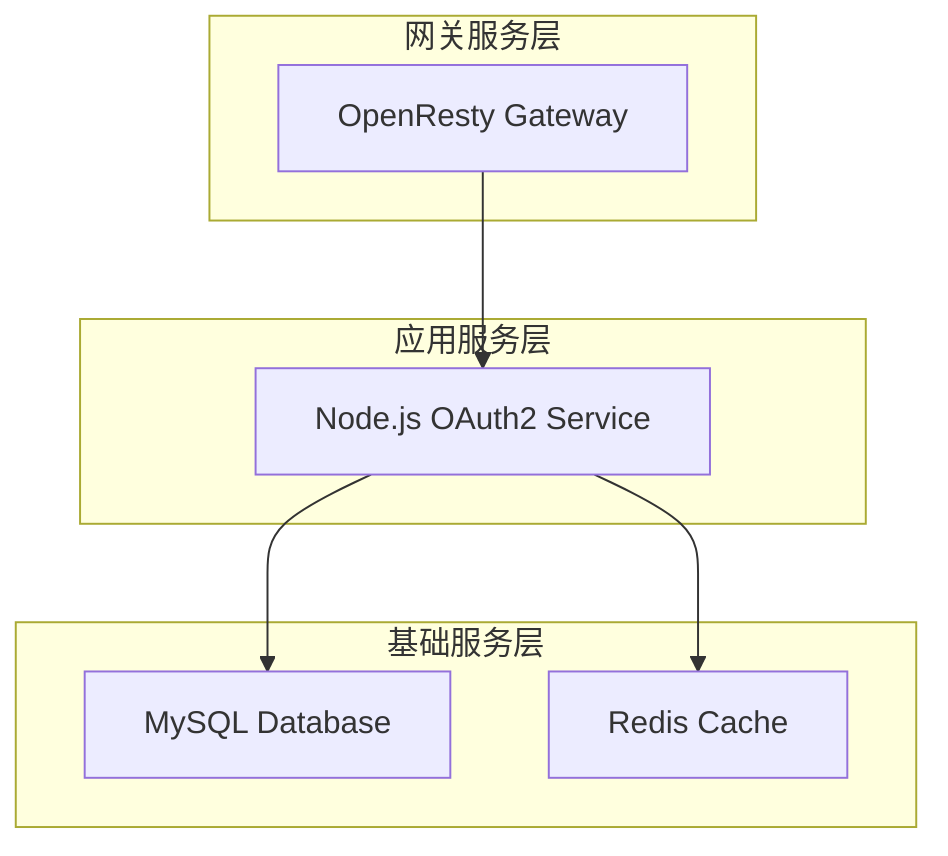

# 架构重构说明 - 基础服务分离

## 🎯 重构目标

将MySQL和Redis作为基础服务独立部署，Node.js服务作为应用服务连接基础服务，实现更好的服务分层和管理。

## 📁 新的目录结构

```
D:\www\nginxzhuanfa\end\
├── 📂 基础服务层
│   ├── database\                           # ✅ 数据库初始化脚本
│   │   └── schema.sql
│   ├── docker-compose-base-service.yml   # ✅ 基础服务编排（MySQL + Redis）
│   ├── mysql-data\                        # MySQL数据持久化
│   └── redis-data\                        # Redis数据持久化
│
├── 📂 应用服务层
│   ├── nodejs\                            # ✅ Node.js应用服务
│   │   ├── server\                        # 应用代码
│   │   ├── docker-compose.yml            # 应用服务编排
│   │   ├── Dockerfile
│   │   ├── package.json
│   │   └── data\                          # Node.js服务专用数据
│   │       ├── logs\
│   │       ├── tmp\
│   │       └── client\
│   └── docker-compose.yml                  # 主项目编排（OpenResty）
│
├── 📂 共享数据层
│   ├── data\
│   │   ├── client\                        # 服务账号文件
│   │   └── map\                          # 映射配置文件
│   └── nginx\                             # OpenResty配置
│
└── 📂 日志和配置
    ├── logs\                              # 全局日志
    └── tmp\                               # 临时文件
```

## 🏗️ 服务分层架构

### 1. 基础服务层 (Infrastructure Layer)

```yaml
# docker-compose-base-service.yml
services:
  api-proxy-mysql:     # MySQL数据库
  api-proxy-redis:     # Redis缓存
networks:
  api-proxy-network:   # 共享网络
```

**职责**：
- 提供数据持久化服务
- 独立的生命周期管理
- 可被多个应用服务共享

### 2. 应用服务层 (Application Layer)

```yaml
# nodejs/docker-compose.yml
services:
  api-proxy-nodejs:    # Node.js OAuth2模拟服务
networks:
  api-proxy-network:   # 连接基础服务网络
```

**职责**：
- 业务逻辑处理
- OAuth2 API模拟
- 连接基础服务获取数据

### 3. 网关服务层 (Gateway Layer)

```yaml
# docker-compose.yml (主项目)
services:
  api-proxy-nginx:     # OpenResty反向代理
networks:
  api-proxy-network:   # 连接应用服务网络
```

**职责**：
- API网关和路由
- 负载均衡
- 统一入口

## 🔧 部署顺序

### 第一阶段：启动基础服务
```bash
# 启动MySQL和Redis基础服务
docker-compose -f docker-compose-base-service.yml up -d
```

### 第二阶段：启动应用服务
```bash
# 启动Node.js OAuth2服务
cd nodejs
docker-compose up -d
```

### 第三阶段：启动网关服务
```bash
# 启动OpenResty代理服务
docker-compose up -d
```

## 📋 网络配置

### 基础服务网络创建
```yaml
# docker-compose-base-service.yml
networks:
  api-proxy-network:
    driver: bridge
    name: api-proxy-network
```

### 应用服务连接外部网络
```yaml
# nodejs/docker-compose.yml
networks:
  api-proxy-network:
    external: true
```

### 网关服务连接外部网络
```yaml
# docker-compose.yml (主项目)
networks:
  api-proxy-network:
    external: true
```

## 🔄 服务依赖关系



## 🚀 部署命令

### 完整部署流程
```bash
# 1. 创建基础服务网络
docker network create api-proxy-network

# 2. 启动基础服务
docker-compose -f docker-compose-base-service.yml up -d

# 3. 启动Node.js应用服务
cd nodejs
docker-compose up -d

# 4. 启动OpenResty网关服务
cd ..
docker-compose up -d
```

### 按序启动脚本
```bash
#!/bin/bash
# deploy.sh

echo "🚀 部署分层架构服务..."

# 1. 启动基础服务
echo "📦 启动基础服务 (MySQL + Redis)..."
docker-compose -f docker-compose-base-service.yml up -d

# 等待基础服务就绪
echo "⏳ 等待基础服务启动..."
sleep 30

# 2. 启动应用服务
echo "🔧 启动应用服务 (Node.js OAuth2)..."
cd nodejs
docker-compose up -d

# 等待应用服务就绪
echo "⏳ 等待应用服务启动..."
sleep 20

# 3. 启动网关服务
echo "🌐 启动网关服务 (OpenResty)..."
cd ..
docker-compose up -d

echo "✅ 所有服务部署完成！"
```

## ✅ 重构优势

### 1. **服务独立性**
- 基础服务可独立升级和扩展
- 应用服务不影响基础服务的稳定性
- 更容易进行A/B测试和灰度发布

### 2. **资源管理**
- 基础服务可配置专门的资源限制
- 应用服务可以根据负载独立扩缩容
- 更好的资源利用率

### 3. **维护简化**
- 基础服务变更不需要重启应用服务
- 数据库维护不影响业务逻辑
- 更清晰的故障边界

### 4. **安全提升**
- 基础服务可以使用不同的安全策略
- 网络访问控制更精确
- 审计和监控更细化

## 🔍 服务发现和连接

### 服务地址配置
```javascript
// Node.js应用中的数据库连接配置
const dbConfig = {
  host: 'api-proxy-mysql',    // 基础服务容器名
  port: 3306,
  database: 'oauth2_mock',
  user: 'oauth2_user',
  password: 'oauth2_password_123456'
};

// Redis连接配置
const redisConfig = {
  host: 'api-proxy-redis',    // 基础服务容器名
  port: 6379,
  password: '123456'
};
```

### 健康检查
```yaml
# 基础服务健康检查
api-proxy-mysql:
  healthcheck:
    test: ["CMD", "mysqladmin", "ping", "-h", "localhost"]

api-proxy-redis:
  healthcheck:
    test: ["CMD", "redis-cli", "ping"]

# 应用服务健康检查
api-proxy-nodejs:
  healthcheck:
    test: ["CMD", "curl", "-f", "http://localhost:8889/health"]
```

## 📊 监控和管理

### 服务状态检查
```bash
# 检查所有服务状态
docker network ls
docker ps --format "table {{.Names}}\t{{.Status}}\t{{.Networks}}"

# 检查网络连通性
docker exec api-proxy-nodejs ping api-proxy-mysql
docker exec api-proxy-nodejs ping api-proxy-redis
```

### 日志管理
```bash
# 查看基础服务日志
docker-compose -f docker-compose-base-service.yml logs

# 查看应用服务日志
cd nodejs && docker-compose logs

# 查看网关服务日志
docker-compose logs
```

---

**总结**: 通过将基础服务分离，我们实现了更清晰的服务分层架构，提高了系统的可维护性、可扩展性和安全性。