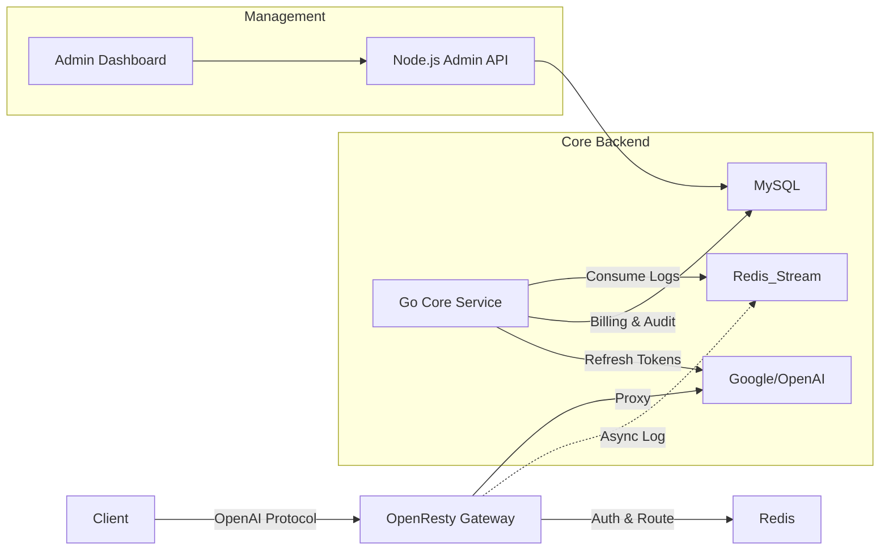

# Universal AI Gateway


**A high-performance, enterprise-grade AI Gateway that unifies Google Vertex AI, OpenAI, Anthropic Claude, AWS Bedrock, Azure, DeepSeek, and Qwen, supporting both the standard OpenAI-compatible API AND native provider interfaces (pass-through mode).**

Built for scale, reliability, and precise billing.

[中文文档](docs/SYSTEM_GUIDE_CN.md) | [English Docs](README.md)

---

## 🚀 Why Universal AI Gateway?

Managing multiple AI providers is a pain. Different APIs, different auth mechanisms, rate limits, and billing complexities.

**Universal AI Gateway solves this by sitting between your users and AI providers:**

*   **Dual Protocol Support**: Use the standard OpenAI format (`/v1/chat/completions`) for compatibility, OR use native provider endpoints (e.g., Vertex `/generateContent`) to access advanced features.
*   **Cost Control**: Precise token-based billing with custom pricing models.
*   **High Performance**: Nginx/Lua + Redis data plane handles thousands of QPS with minimal latency.
*   **Reliability**: Go-based core service automatically refreshes Google Vertex tokens and syncs data.
*   **Security**: RBAC, detailed audit logs, and privacy-first design.

## ✨ Key Features

*   **Multi-Provider Support**: 
    *   Google Vertex AI (Gemini Pro/Flash)
    *   OpenAI (GPT-3.5/4/4o)
    *   Anthropic (Claude 3)
    *   Azure OpenAI
    *   AWS Bedrock
    *   DeepSeek / Qwen (Alibaba)
*   **Dual Mode API**: 
    *   **Standard Mode**: OpenAI-compatible wrapper.
    *   **Native Mode**: Direct pass-through for full feature access.
*   **Smart Routing**: Load balance traffic across multiple accounts/keys with weighted routing.
*   **Auto Token Refresh**: Automatically manages Google Service Account OAuth2 flows in the background.
*   **Real-time Billing**: Calculates cost per request based on input/output tokens or request count.
*   **Mock Mode**: Built-in full-stack mock mode for testing without real API keys.
*   **Visual Dashboard**: A clean Admin UI for managing channels, tokens, and monitoring logs.

---

## 🏗 Architecture

The system follows a microservices architecture designed for performance and stability:



*   **Data Plane**: OpenResty (Nginx + Lua) + Redis. Zero DB dependency on the hot path.
*   **Control Plane**: Go Service (High reliability tasks) + Node.js (Management API).

---

## ⚡ Quick Start

### Prerequisites
*   Docker & Docker Compose installed.

### 1. Clone & Configure
```bash
git clone https://github.com/your-username/gemini-proxy.git
cd gemini-proxy

# Copy environment config
cp .env.example .env

# (Optional) Edit .env to set a secure JWT_SECRET
# vim .env
```

### 2. Start Services
We provide a handy script to bootstrap everything.

```bash
# Initialize directories and start services
chmod +x run.sh
./run.sh start all

# Initialize database schema
./run.sh update_schema
```

### 3. Access Dashboard
Open your browser and navigate to:
*   **URL**: `http://localhost:8889/admin/index.html`
*   **Default User**: `admin`
*   **Default Password**: `123456`

### 4. Make Your First Request
1.  Create a **Channel** in the dashboard (e.g., bind a Google Service Account).
2.  Create a **Virtual Token** (e.g., `sk-test-123`).
3.  Call the API:

```bash
curl http://localhost:8080/v1/chat/completions \
  -H "Content-Type: application/json" \
  -H "Authorization: Bearer sk-test-123" \
  -d '{
    "model": "gemini-1.5-pro",
    "messages": [{"role": "user", "content": "Hello!"}]
  }'
```

---

## 🛠 Advanced Configuration

### Mock Mode (Testing)
Want to test without real API keys? Enable Mock Mode in `.env`:
```ini
ENABLE_MOCK_MODE=true
```
Restart services, and all requests will be handled by the internal mock server.

### Privacy Mode
By default, request/response bodies are **NOT** logged to the database to protect user privacy.
To enable full logging for debugging:
```ini
LOG_SAVE_BODY=true
```

---

## 🤝 Contributing

Contributions are welcome! Please check out the [issues](https://github.com/your-username/gemini-proxy/issues) or submit a PR.

1.  Fork the Project
2.  Create your Feature Branch (`git checkout -b feature/AmazingFeature`)
3.  Commit your Changes (`git commit -m 'Add some AmazingFeature'`)
4.  Push to the Branch (`git push origin feature/AmazingFeature`)
5.  Open a Pull Request

## 📄 License

Distributed under the MIT License. See `LICENSE` for more information.
