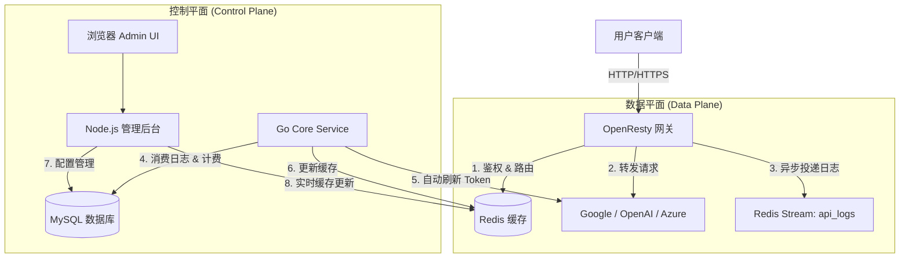

# Universal AI Gateway - 全能 AI 网关系统手册

**版本**: 3.0 (Go + Node.js + OpenResty 混合架构)  
**更新日期**: 2025-12-07

---

## 1. 系统概述

这是一个企业级的高性能 AI 接口网关系统。它像一个“超级插座”：后端连接各种复杂的 AI 模型（如 Google Vertex AI、OpenAI、Claude、Azure、AWS Bedrock 等），**前端提供双重接口支持：既支持统一的、标准的 OpenAI 格式（兼容现有生态），也支持厂商原生接口透传（保留全部高级特性）。**

### 核心优势
*   **双协议支持**: 同时支持 OpenAI 标准接口转换和原生接口（如 Vertex/Anthropic）透传，满足不同场景需求。
*   **多模型统一**: 聚合管理 Google Vertex AI、OpenAI、Claude、Azure、Bedrock 等主流模型。
*   **高性能转发**: 基于 Nginx/Lua 和 Redis，无数据库依赖，单机支持数千 QPS。
*   **精准计费**: 内置 Go 计费引擎，支持按 Token、按次、按模型定价，支持流式精确统计。
*   **自动保活**: Go 核心服务自动刷新 Google Vertex Token，永不过期。
*   **企业级安全**: 完善的 RBAC 权限系统、请求日志审计、敏感信息（Body）隐私保护开关。
*   **全链路 Mock**: 一键开启模拟模式，无需真实 Key 即可进行全功能测试。

---

## 2. 业务架构



---

## 3. 安装与部署

### 3.1 环境要求
*   Docker & Docker Compose
*   端口占用: 8080 (API), 8889 (Admin)

### 3.2 快速启动

1.  **配置环境**:
    ```bash
    cp .env.example .env
    # 修改 .env 中的 JWT_SECRET 为强随机字符串
    ```

2.  **启动服务**:
    ```bash
    # 使用一键脚本 (Linux/Mac)
    chmod +x run.sh
    ./run.sh start all
    
    # 初始化/更新数据库
    ./run.sh update_schema
    ```

3.  **访问系统**:
    *   **管理后台**: `http://localhost:8889/admin/index.html`
        *   默认账号: `admin`
        *   默认密码: `123456`
    *   **API 入口**: `http://localhost:8880`

---

## 4. 功能使用手册

### 4.1 渠道管理 (Channels)
渠道是您拥有的真实 AI 账号资源。

1.  **创建渠道**:
    *   类型: 选择 `Vertex AI`、`OpenAI` 等。
    *   凭证: 填入 API Key 或 Google Service Account JSON。
    *   *提示*: 系统会自动校验凭证格式。如果是 Vertex，Go 服务会在后台自动换取 Access Token。

2.  **绑定模型与计费**:
    *   点击“Models”按钮。
    *   选择该渠道支持的模型（如 `gpt-4`）。
    *   **计费模式**:
        *   `Token`: 按官方 Token 数计费（价格在“模型管理”中配置）。
        *   `Request`: 按次计费（例如 0.1元/次）。
    *   *注意*: 系统会校验全局价格配置，防止配置了按次计费但价格为 0 的情况。

### 4.2 令牌管理 (Virtual Tokens)
这是分发给最终用户的 `sk-xxxx` 密钥。

1.  **创建令牌**: 设置过期时间、额度限制。
2.  **配置路由**: 选择该令牌可以使用哪些渠道。支持权重配置（负载均衡）。

### 4.3 日志审计 (Request Logs)
*   查看所有 API 调用的详细流水。
*   **隐私保护**: 默认情况下 (`LOG_SAVE_BODY=false`)，不记录请求/响应内容。只有当 API 报错（非 200）时，才会强制记录错误信息以便排查。

### 4.4 系统监控 (System Status)
*   在“任务调度”页面顶部，查看 Go 核心服务、Redis、MySQL、Nginx 的实时健康状态。
*   如果 Go 服务心跳丢失，请检查 Docker 日志。

---

## 5. 高级功能配置

### 5.1 开启 Mock 模式 (全链路测试)
在没有真实 Key 的情况下进行测试。

1.  修改 `.env`: `ENABLE_MOCK_MODE=true`。
2.  重启服务: `./run.sh restart all`。
3.  效果: 所有 API 请求都会被 Nginx 拦截并转发到内部 Mock 接口，返回模拟数据。Go 服务也会向 Mock 接口申请 Token。

### 5.2 隐私开关
控制是否记录 API 的 Request/Response Body。

1.  修改 `.env`: `LOG_SAVE_BODY=true` (开启记录) 或 `false` (关闭，默认)。
2.  重启 Go 服务: `docker compose -f docker-compose-base-service.yml up -d --build api-log-processor`。

---

## 6. 运维排查指南

### 6.1 查看日志
```bash
# 查看 Go 核心服务日志 (计费、Token刷新)
docker logs -f api-log-processor

# 查看 Nginx 访问日志
tail -f logs/access.log

# 查看 Node.js 错误日志
docker logs -f api-proxy-nodejs
```

### 6.2 常见问题

**Q: 提示 "Rate limit exceeded"?**
*   检查渠道配置中的 RPM (Requests Per Minute) 设置。
*   检查令牌是否配置了每分钟限制。

**Q: Vertex AI 提示 401 Unauthorized?**
*   去“Redis 观测”页面，查看 `real_token:channel_id` 是否存在。
*   如果不存在，检查 Go 服务日志，看是否刷新 Token 失败（如 JSON Key 无效）。

**Q: 计费显示费用为 0?**
*   检查“模型管理”中是否配置了该模型的 `Input/Output Price`。
*   检查日志中 `Total Tokens` 是否为 0（可能是解析失败，Go 会尝试用 tiktoken 兜底）。

---

## 7. 数据库字典 (Core Tables)

### `sys_channels` (渠道表)
*   `type`: 渠道类型 (vertex, openai, azure...)
*   `models_config`: JSON, 存储该渠道的模型绑定及计费模式 (`mode: "token"|"request"`).

### `sys_models` (全局模型表)
*   `input_price`: 每 1k Token 输入价格。
*   `output_price`: 每 1k Token 输出价格。
*   `request_price`: 单次调用价格。

### `sys_request_logs` (流水日志表)
*   `request_id`: 唯一请求 ID。
*   `cost`: 本次请求总费用 (DECIMAL 24,12)。
*   `req_body`/`res_body`: 请求响应体 (受隐私开关控制)。